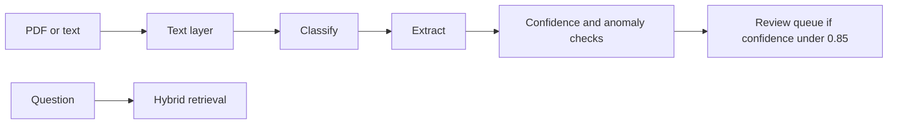

# Financial Document Agent

Ingests synthetic invoices as text or small text-layer PDFs, extracts vendor, invoice number, date, totals, and line items, and routes low-confidence fields to review. A LangGraph workflow classifies, extracts, checks duplicates and tax or total rules, and states what it found. Retrieval is hybrid BM25 plus sentence embeddings.

## Architecture



Image OCR is an optional later step. This benchmark reads digital PDFs, not photographed scans.

## Run

```bash
uv sync --extra dev
uv run pytest
uv run uvicorn app.main:app --reload
uv run python -m evaluation.run_eval
```

`EMBEDDER=hash` and `CORPUS_SIZE=100` start the API without the sentence-transformer download. The benchmark uses MiniLM and writes `evaluation/results/benchmark.json`.

## Docker

```bash
docker compose up --build
```

Compose includes PostgreSQL with pgvector for a later vector-store swap. The default API path keeps embeddings in process.
