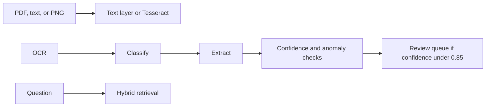

# Financial Document Agent

[](https://github.com/AsrithaReddy-123/financial-document-agent/actions/workflows/ci.yml)

Ingests synthetic invoices as text, text-layer PDFs, or PNG images. It extracts vendor, invoice number, date, totals, and line items, and routes low-confidence fields to review. A LangGraph workflow classifies, extracts, checks duplicates and tax or total rules, and states what it found. Retrieval is hybrid BM25 plus sentence embeddings.

## Measured results

5,000 synthetic invoices. 200 retrieval questions. Embedder `sentence-transformers/all-MiniLM-L6-v2`.

| Metric | Result |
| --- | ---: |
| Clean field accuracy | 1.00 |
| Anomaly precision | 1.00 |
| Labeled anomalies | 498 |
| Sent to human review | 5.5% |
| Recall@5 | 0.955 |

Field accuracy is the clean subset after a PDF text-layer round trip. Image OCR is a separate path: `app/ocr.py` uses Tesseract, and CI renders a PNG and checks that the vendor and invoice number are read back. The retrieval and extraction artifact is [`evaluation/results/benchmark.json`](evaluation/results/benchmark.json).

## Architecture



## Run

```bash
uv sync --extra dev
uv run pytest
uv run uvicorn app.main:app --reload
uv run python -m evaluation.run_eval
```

`EMBEDDER=hash` and `CORPUS_SIZE=100` start the API without the sentence-transformer download. The benchmark uses MiniLM and writes `evaluation/results/benchmark.json`.

## Docker

```bash
docker compose up --build
```

Compose includes PostgreSQL with pgvector for a later vector-store swap. The default API path keeps embeddings in process.
